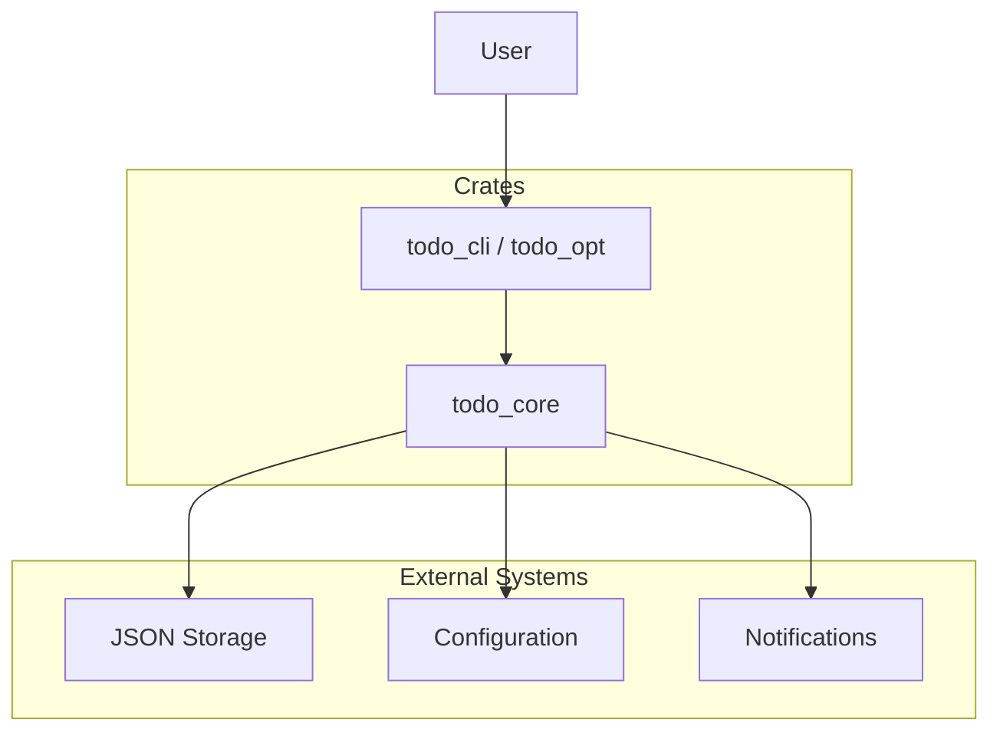

# todo_opt - CLI Task Manager


**todo_opt** is a powerful, keyboard-centric CLI task manager built with Rust. It is designed for developers and power users who want to manage their tasks efficiently directly from the terminal. It supports urgency tracking, scheduling, notifications, and customizable themes.

## 1. Project Overview and Purpose

The primary goal of `todo_opt` is to provide a fast, reliable, and unobtrusive way to manage tasks. Unlike heavy GUI applications, `todo_opt` integrates seamlessly into your terminal workflow.

**Key Features:**
- **Fast & Lightweight:** Built with Rust for instant startup and minimal resource usage.
- **Task Management:** Add, edit, delete, and list tasks with ease.
- **Scheduling:** Schedule tasks for specific dates and times.
- **Urgency Tracking:** Mark tasks as urgent to prioritize them.
- **Notifications:** Desktop notifications for due tasks (Linux & Windows).
- **Themes:** Built-in themes (`noir`, `solarized`, `default`) to match your terminal aesthetic.
- **JSON Storage:** Data is stored in a simple, portable JSON format.

## 2. System Architecture

The project is organized as a Rust workspace with a modular architecture:



- **crates/todo_cli**: The binary crate (`todo_opt`). It handles command-line argument parsing (using `clap`) and output formatting (using `tabled`).
- **crates/todo_core**: The library crate. It contains the core business logic, data models (`Task`, `TaskStatus`), storage implementation (`json_store`), configuration management, and platform-specific notification logic.

## 3. Installation and Setup

### Prerequisites
- **Rust**: Latest stable version (install via [rustup](https://rustup.rs/)).
- **Build Tools**:
  - **Windows**: Visual Studio Build Tools or MinGW-w64.
  - **Linux/macOS**: GCC or Clang (usually pre-installed).

### Installation

1. **Clone the repository:**
   ```bash
   git clone https://github.com/your-username/todo_cli.git
   cd todo_cli
   ```

2. **Build the project:**
   ```bash
   cargo build --release
   ```

3. **Install the binary:**
   You can copy the binary to your PATH or use `cargo install`:
   ```bash
   cargo install --path crates/todo_cli
   ```

   The binary will be named `todo_opt`.

## 4. Configuration Options

`todo_opt` is highly configurable. Configuration is stored in `config.json`.

### Config Location
- **Windows**: `%APPDATA%\todoapp\config.json`
- **Linux/Unix**: `$HOME/.config/todoapp/config.json`
- **Override**: Set the `TODOAPP_CONFIG_PATH` environment variable.

### Configuration Format
The configuration file is a JSON object with the following keys:

| Key | Type | Description |
|-----|------|-------------|
| `theme` | String | UI Theme. Options: `default`, `noir`, `solarized`. |
| `aliases` | Map | Custom command aliases. |

**Example `config.json`:**
```json
{
  "theme": "noir",
  "aliases": {
    "ls": "list today",
    "all": "list backlog"
  }
}
```

### Environment Variables
- `TODOAPP_STORE_PATH`: Override the path to the tasks data file (`tasks.json`).
- `TODOAPP_CONFIG_PATH`: Override the path to the configuration file.

## 5. Usage Examples and API

Run `todo_opt --help` for a full list of commands.

### Basic Commands

- **Add a task:**
  ```bash
  todo_opt add "Buy milk"
  todo_opt add "Finish report" --urgent
  ```

- **List tasks:**
  ```bash
  todo_opt list today     # List tasks for today
  todo_opt list backlog   # List all other tasks
  ```

- **Mark as done:**
  ```bash
  todo_opt done <ID>
  todo_opt done <ID> -m "Completed with notes"
  ```

- **Edit a task:**
  ```bash
  todo_opt edit <ID> "New Title"
  ```

- **Delete a task:**
  ```bash
  todo_opt delete <ID>
  ```

### Advanced Features

- **Scheduling:**
  ```bash
  todo_opt schedule <ID> "2023-12-25 10:00"
  todo_opt reschedule <ID> "2023-12-26 14:00"
  ```
  *Format supported: RFC3339 or simple date/time strings like "YYYY-MM-DD HH:MM:SS" or "YYYY-MM-DD".*

- **Urgency:**
  ```bash
  todo_opt urgent <ID>          # Mark as urgent
  todo_opt urgent <ID> --clear  # Remove urgency
  ```

- **Focus:**
  ```bash
  todo_opt focus <ID>  # Highlight a specific task
  ```

- **Notifications:**
  ```bash
  todo_opt notify      # Trigger notifications for due tasks
  ```

- **Show Details:**
  ```bash
  todo_opt show <ID>   # Show full details of a task
  ```

### Global Flags
- `--json`: Output result in JSON format (useful for scripting).
- `--config-override KEY=VALUE`: Override config for a single run (e.g., `--config-override theme=solarized`).

## 6. Development Guidelines

We welcome contributions! Please follow these guidelines:

### Setup
1. Fork and clone the repo.
2. Install dependencies (standard Cargo crates).

### Coding Standards
- Follow Rust idioms and `clippy` suggestions.
- Ensure code is formatted with `cargo fmt`.
- Add tests for new functionality.

### Contribution Process
1. Create a feature branch (`git checkout -b feature/amazing-feature`).
2. Commit your changes.
3. Push to the branch.
4. Open a Pull Request.

## 7. Testing Methodology

The project uses Rust's built-in testing framework.

- **Unit Tests**: Located within source files (e.g., `mod tests`). Run with:
  ```bash
  cargo test
  ```
- **Integration Tests**: Located in the `tests/` directory. These tests run the CLI binary against temporary storage to verify end-to-end functionality.
  ```bash
  cargo test --test cli_smoke
  ```
- **CI/CD**: GitHub Actions workflows (`.github/workflows/`) run tests, linting (`clippy`), and formatting checks (`rustfmt`) on every push.

## 8. License and Contact

**License**: MIT License. See [LICENSE](LICENSE) for details.

**Contact**:
For bugs and feature requests, please open an issue on the GitHub repository.
